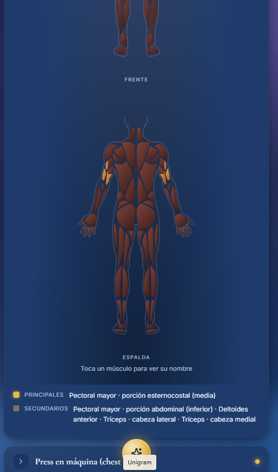
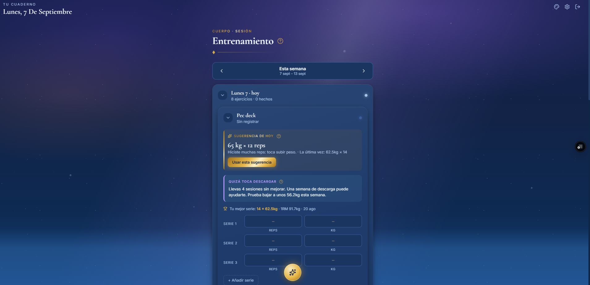

# Tu cuaderno




App personal de entrenamiento y vida: registro de gimnasio con progreso, hábitos,
tareas, notas, escritura, sueño y objetivos. Cada usuario tiene su espacio privado.
Instalable en el móvil (PWA) y con temas personalizables.

## Qué hay dentro

```
backend/    API en FastAPI (Python) — la lógica y los datos
frontend/   App en React + Vite — lo que se ve, instalable como PWA
```

- **Base de datos y login:** Supabase (PostgreSQL + Auth)
- **Backend:** FastAPI, SQLAlchemy
- **Frontend:** React, Vite, recharts (gráficas), PWA
- **Despliegue:** backend en Render, frontend en Vercel (ver `guia-despliegue.md`)

## Arrancar en local

Necesitas: Python 3.12+, Node 18+, y un proyecto de Supabase (gratis).

### 1. Backend

```bash
cd backend
python -m venv .venv
source .venv/bin/activate        # en Windows: .venv\Scripts\activate
pip install -r requirements.txt
cp .env.example .env             # luego rellena .env con tus claves de Supabase
uvicorn app.main:app --reload
```

La API queda en http://localhost:8000 y su documentación interactiva en
http://localhost:8000/docs

### 2. Frontend

En otra terminal:

```bash
cd frontend
npm install
cp .env.example .env             # rellena con tus claves de Supabase y la URL del backend
npm run dev
```

La app queda en http://localhost:5173

## Las claves (.env)

Ninguna clave va en el código; viven en archivos `.env` que **no se suben a Git**.
Cada parte tiene su `.env.example` como plantilla. Resumen:

| Archivo | Variable | Para qué |
|---|---|---|
| backend/.env | `DATABASE_URL` | conexión a la base de datos |
| backend/.env | `SUPABASE_JWT_SECRET` | verificar el login |
| backend/.env | `CORS_ORIGINS` | qué webs pueden llamar a la API |
| backend/.env | `ANTHROPIC_API_KEY` | generar temas con IA (opcional) |
| frontend/.env | `VITE_SUPABASE_URL` | conectar el login |
| frontend/.env | `VITE_SUPABASE_ANON_KEY` | clave pública de Supabase |
| frontend/.env | `VITE_API_URL` | dónde está el backend |

## Estructura del backend

| Archivo | Responsabilidad |
|---|---|
| `app/main.py` | arranca la API y enchufa los módulos |
| `app/config.py` | lee las claves del .env |
| `app/database.py` | conexión a PostgreSQL |
| `app/models.py` | las tablas (SQLAlchemy) |
| `app/schemas.py` | forma de los datos que entran/salen |
| `app/auth.py` | verifica el usuario por su token |
| `app/routers/` | los endpoints, un archivo por módulo |

## Estructura del frontend

| Carpeta/archivo | Responsabilidad |
|---|---|
| `src/App.jsx` | sesión, navegación y montaje general |
| `src/lib/api.js` | todas las llamadas al backend |
| `src/lib/supabase.js` | cliente de login |
| `src/lib/theme.js` | sistema de temas (colores, oro metálico) |
| `src/lib/ThemeContext.jsx` | reparte y guarda el tema activo |
| `src/components/` | piezas reutilizables (UI, login, errores) |
| `src/sections/` | las 8 secciones de la app |


EOF
echo "README raíz creado"
